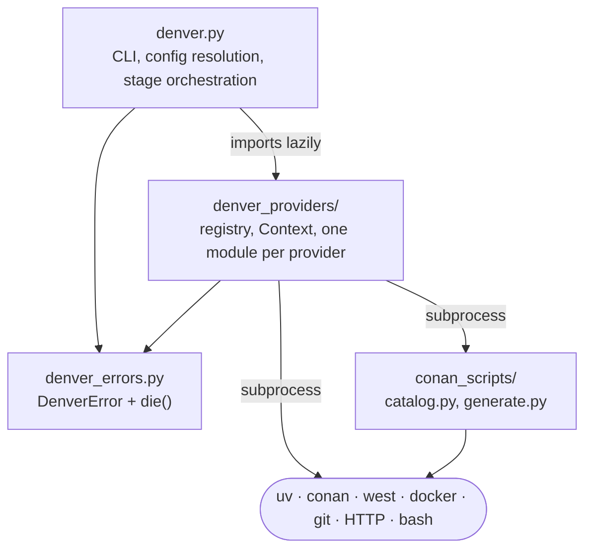
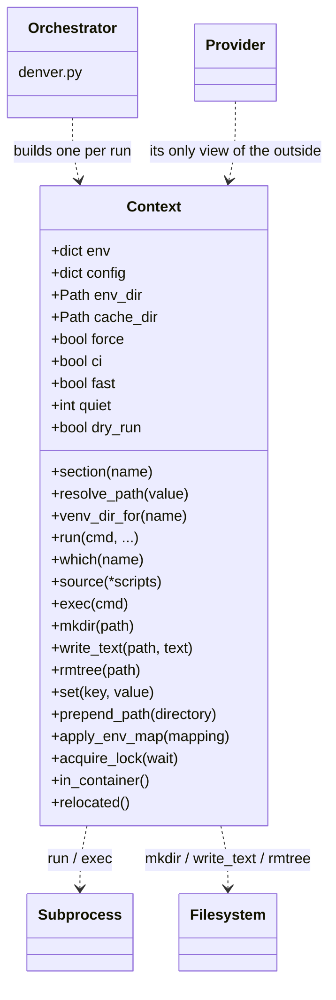

# 5. Building Block View

## 5.1 Level 1: whitebox denver



| Building block | File(s) | Responsibility |
|---|---|---|
| **Orchestrator** | `src/denver.py` | CLI parsing, config loading and merging, defaults, stage filtering, hooks, running stages, `--show-config`, `clean`, completion |
| **Error module** | `src/denver_errors.py` | `DenverError` and `die()`. A leaf module — both sides import it, it imports neither |
| **Provider package** | `src/denver_providers/` | The registry, `Context`, `Provider`, and one module per provider |
| **Conan scripts** | `src/denver_providers/conan_scripts/` | Recipe scanning and catalog generation. Not importable, driven only by subprocess |
| **Examples** | `examples/` | Real environments, not framework code |

`denver.py` imports the provider package **lazily**, so `--help`, `--version`
and completion never pay for importing every provider module.

## 5.2 Level 2: inside the orchestrator

`src/denver.py` is one flat module, deliberately free of provider-specific
knowledge apart from one table of default resolvers. What it does for
`denver run <env>`, in order:

| Step | Function | What it does |
|---|---|---|
| 1 | `main()` / `build_arg_parser()` | Parse `run` / `clean` / `complete`, plus the env's own `denver-custom-args:` |
| 2 | `resolve_env_dir()` | Turn `<env>` into a directory — a path, or a name found via `DENVER_ENV_PATH` |
| 3 | `load_config()` | Follow the `import:` chain, merge base-first with `deep_merge()` |
| 4 | `validate_*()` | Config version, `denver-version:`, top-level keys, stage filters, hook keys |
| 5 | `resolve_full_config()` | Section stacking, build the `Context`, fill in every provider default |
| 6 | `filtered_stage_ids()` | Apply `--until`, `--skip`, `disabled:`, `depends-on:` |
| 7 | `run_stages()` | Hooks, stage env, wrapper relocation or direct run, performance records |
| 8 | `resolve_command()` → `ctx.exec()` | Replace denver's own process with the final command |

`--show-config` stops after step 5 and prints. Same function, same result —
that is the point (chapter 4.3).

Details: [config resolution](config_resolution.md).

## 5.3 Level 2: inside the provider package

| Module | Contents |
|---|---|
| `__init__.py` | `PROVIDERS` registry, `make_stage()`, `load_extension_providers()` |
| `base.py` | `Provider` base class: `name`, `kind`, `KEYS`, `resolve_defaults()`, `setup()`, `wrap()` |
| `context.py` | `Context` — the one object every provider is handed — plus interpolation, logging, banners, validation helpers |
| `uv.py`, `conan.py`, `zephyr.py`, `docker.py`, `download.py`, `git.py`, `nix.py`, `custom.py` | One provider each |

Details: [the provider layer](providers.md).

## 5.4 Level 2: `Context`

`Context` is the only way a provider touches anything outside itself.



| Group | Members |
|---|---|
| Paths | `env_dir`, `state dir`, `venv_dir_for(name)`, `cache_dir`, `resolve_path()` |
| Environment | `env` (mutable dict), `set`, `setdefault`, `prepend_path`, `extend_env_var`, `apply_env_map` |
| Config | `config`, `section(name)` — interpolated |
| Processes | `run()`, `which()`, `source()`, `exec()` |
| Filesystem | `mkdir()`, `write_text()`, `append_text()`, `touch()`, `unlink()`, `rmtree()` |
| Run mode | `force`, `ci`, `fast`, `quiet`, `dry_run`, `relocated`, `in_container` |
| Concurrency | `acquire_lock()` — one run per environment |

Everything a `--dry-run` must intercept, and everything a test must fake,
goes through this one class. No provider imports `subprocess` or `shutil`.

## 5.5 Level 3

- [The provider layer](providers.md) — registry, lifecycle, each built-in provider, extension providers.
- [Config resolution](config_resolution.md) — imports, merging, stacking, defaults, overrides.

```{toctree}
:maxdepth: 1
:hidden:

providers
config_resolution
```
