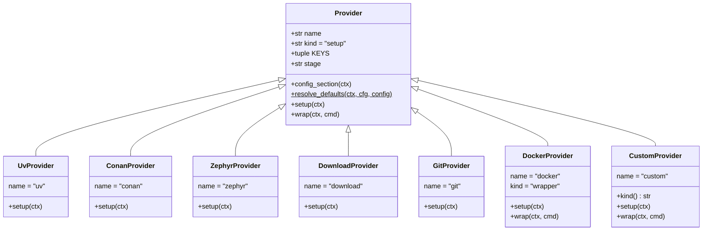

# 5.6 The provider layer

## Registry

`PROVIDERS` in `denver_providers/__init__.py` maps a provider name to its
class:

```python
PROVIDERS = {
    "uv": UvProvider,
    "conan": ConanProvider,
    "zephyr": ZephyrProvider,
    "docker": DockerProvider,
    "custom": CustomProvider,
    "download": DownloadProvider,
    "git": GitProvider,
    "nix": NixProvider,
}
```

`make_stage(stage_id, config)` is the only place a `stages:` entry becomes a
live object. It reads the section's `provider:` key, looks it up, and dies
with the known names if the key is missing or unknown. The stage id is never
used to guess a type.

## Lifecycle



`kind` is a plain class attribute everywhere except `CustomProvider`, where
it is a read-only property: `"wrapper"` when the stage sets `launcher:`, else
`"setup"`.

Every provider extends `Provider` (`base.py`). Four members matter.

| Member | Meaning |
|---|---|
| `name` | The provider type, as written in `provider:` |
| `kind` | `"setup"` builds part of the env. `"wrapper"` moves the run somewhere else |
| `KEYS` | Every config key this provider understands. Drives `--show-config-full` |
| `resolve_defaults(ctx, cfg, config)` | Classmethod. Computes the complete section, once, centrally |
| `setup(ctx)` | Build the env piece. Mutate `ctx.env` |
| `wrap(ctx, cmd)` | Wrappers only. Return the command that should really run |

Order per run: all `resolve_defaults()` first, in `stages:` order, for every
stage. Then `setup()`/`wrap()`. So `setup()` never computes a default — it
reads what is already there.

`--fast` is read inside `setup()`, not centrally. Rule: skip the build, only
activate what an earlier full run produced. Nothing to activate → die with a
clear message. A provider with no such state (`custom`) skips itself.

## Built-in providers

| Provider | Kind | Does | Talks to |
|---|---|---|---|
| `uv` | setup | Create/activate a venv, install requirements, apply venv patches | `uv` |
| `conan` | setup | Detect profile, export recipes, install the conanfile, source `conanbuildenv.sh` | `conan`, `conan_scripts/` |
| `zephyr` | setup | Init/update a West workspace, apply patches, fetch blobs, set `ZEPHYR_BASE` | `west`, `git` |
| `download` | setup | Fetch release archives, verify checksums, unpack, extend `PATH` | HTTP(S) |
| `git` | setup | Clone or fetch a checkout, pinned to one revision (detached) | `git` |
| `nix` | setup | Evaluate a flake's devShell once, cache it, source it into the environment | `nix`, `git` |
| `docker` | wrapper | Build/enter a compose service, re-invoke denver inside it | `docker compose` |
| `custom` | setup, or wrapper with `launcher:` | Run one command, source a script, or relocate the final command | whatever the command is |

Each provider's own page under [Providers](../../providers/uv.md) is the key
reference. These chapters only cover the design.

`download` and `git` exist because the same shell script kept getting
rewritten per project: download, checksum, unpack, PATH — or clone, fetch,
checkout a pinned tag. Both are idempotent and `--fast`-aware once they are
providers.

`nix` is the same argument for a project that already has a flake: it
sources `nix print-dev-env`'s output rather than relocating into `nix
develop --command`, so it stays a *setup* provider — stages after it still
extend the environment it built, and its cached evaluation is what makes it
cheap enough to sit in front of every command.

## Extension providers

A project can add its own provider without forking denver:

```yaml
extensions:
  providers:
    dirs: [my_providers]
```

- Every `*.py` directly in a listed dir is imported. Files starting with `_` are skipped.
- Each file must define `PROVIDER`, a `Provider` subclass.
- It registers under its own `name` and is then usable as `provider: <name>`, exactly like a built-in.
- Unknown keys under `extensions:` are an error, so a typo cannot silently disable the mechanism.

## Why this shape

- Adding a provider touches one file plus one registry line. `run_stages()` never changes.
- The orchestrator knows no provider specifics, apart from one table of default resolvers.
- Test doubles are trivial: patch `Context.run()`/`which()` and the whole layer is offline.
