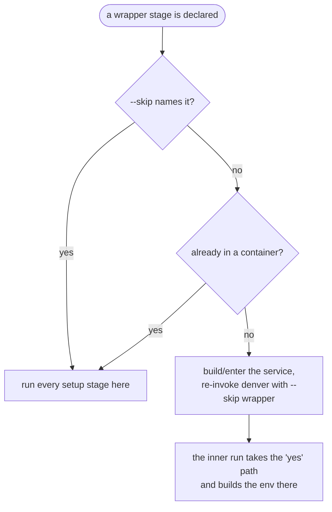

# ADR-0004: A container is a wrapper stage that relocates the run

| | |
|---|---|
| **Status** | accepted |
| **Affects** | [chapter 4.7](../04_solution_strategy/index.md), [chapter 6.3](../06_runtime_view/index.md) |

## Context

Projects that build inside Docker usually keep two definitions: one for the
host, one for the container. They drift. "Does it still work without Docker?"
becomes a question nobody can answer quickly.

denver needed containers without splitting the pipeline in two.

## Decision

`docker` is a **wrapper** provider. It builds no part of the environment.
Instead:

1. On the host, it builds/prepares the compose service.
2. denver renders a re-invocation of itself: `denver run <env> --skip docker …`.
3. `wrap()` turns that into `docker compose run --rm <service> <that command>`.
4. `exec()` replaces the host process. The inner denver runs the remaining stages *inside* the container.

A `custom` stage with `launcher:` is a wrapper too — the mechanism is not
Docker-specific.

Two questions are answered separately, and stated rather than guessed:

| Question | Answer |
|---|---|
| "Did a wrapper relocate me?" | `DENVER_RELOCATED`, set by the relocating run. denver's own bookkeeping, so it also works for a non-container launcher |
| "Am I inside a container?" | `DENVER_IN_CONTAINER`, or a probe of `/.dockerenv`, `/run/.containerenv`, `$container`, `/run/systemd/container` |

Not probed: `/proc/self/cgroup`. Under cgroup v2 it commonly reads `0::/`
either way, so it answers nothing.

## Consequences

- One `stages:` list, one config, host or container. `--skip docker` is the whole difference.
- Being inside a container stops any wrapper from relocating again — regardless of *which* env put you there. Starting an env from inside a devshell builds right there.
- A forced `--skip` is distinguishable from one the user typed, so denver never reports it as the user's choice.
- `depends-on:` a wrapper stage is near-useless: the inner run always sees that wrapper as skipped. Depend on a setup stage instead.
- `--dry-run` cannot preview past the wrapper boundary — entering the container is itself one of the commands not being run. denver says so and points at `--skip docker`.
- The re-invocation assumes the same checkout is reachable inside the container. That is the project's compose file's job, not denver's. See [chapter 11](../11_technical_risks/index.md).
