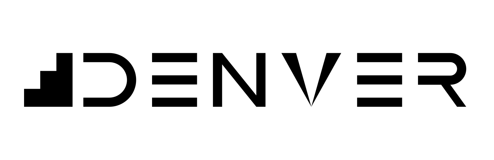

# denver



Development Environments as code — reproducible, flexible, simple and fast.

> **Note**
>
> This documentation is also published as **plain Markdown**, one file per page
> mirroring this exact page tree — meant for AI tools/LLMs to ingest directly,
> without having to scrape rendered HTML. Start at
> <a href="markdown/index.md">markdown/index.md</a>; every page below has a
> twin under <code>markdown/</code> at the same path. See <code>doc/conf.py</code>
> and <code>examples/doc-env/denver.toml</code> for how it's built.

## New to denver? Read in this order

The pages below are written to be read front to back — each one picks up
where the last left off.

| # | Page | What you get out of it |
|---|---|---|
| 1 | [What problem denver solves](introduction/index.md) | Why a `denver.toml` beats a `setup.sh`, built up one step at a time |
| 2 | [What is a denver environment?](introduction/index.md#what-is-a-denver-environment) | The model: environments, stages, providers |
| 3 | [Install denver](introduction/install.md) | Getting the `denver` command onto your machine |
| 4 | [denver in 5 minutes](quickstart/five-minutes.md) | Run the smallest possible environment end to end and watch it work |
| 5 | [denver in 15 minutes](quickstart/creating-environments.md) | Build a bigger, more realistic environment yourself, from an empty folder |

After that, the rest is reference you dip into as needed: the
[`denver` command](cli/arguments.md), the
[`denver.toml` schema](configuration/denver-toml.md), and one page
[per provider](providers/uv.md).

## Introduction

Start here if you have never seen a `denver.toml`.

```{toctree}
:maxdepth: 1
:caption: Introduction
:hidden:

introduction/index
introduction/install
```

## Quickstart

Run the smallest possible environment, then build a bigger, more realistic
one yourself from an empty folder — the whole model in action before any
reference material.

```{toctree}
:maxdepth: 1
:caption: Quickstart
:hidden:

quickstart/five-minutes
quickstart/creating-environments
quickstart/examples
```

## Concepts

The vocabulary and the design principles behind it — read these to
understand *why* denver refuses to guess things other tools guess for you.

```{toctree}
:maxdepth: 1
:caption: Concepts
:hidden:

concepts/glossary
concepts/philosophy
```

## `denver` command

Everything you can pass to `denver`, and the environment variables it reads.

```{toctree}
:maxdepth: 1
:caption: denver command
:hidden:

cli/arguments
cli/completion
cli/environment-variables
```

## Configuration

The complete `denver.toml` reference: every top-level key, every generic
stage key, how `import:` chains merge, and the mechanisms behind layering,
hooks, overrides and fingerprinting.

```{toctree}
:maxdepth: 1
:caption: Configuration
:hidden:

configuration/denver-toml
```

## Providers

One page per provider: a full key reference for that provider's
`denver.toml` section (every key, what it does, its default) plus design
notes on the patterns it supports and how it behaves under
`--fast`/`--force`.

| Provider | Purpose |
|---|---|
| [`uv`](providers/uv.md) | Create/manage a Python virtualenv via `uv` |
| [`conan`](providers/conan.md) | Provision native tools (compilers, cmake, ninja) via Conan |
| [`docker`](providers/docker.md) | Wrapper: relocate the pipeline into a compose service |
| [`zephyr`](providers/zephyr.md) | Manage a West (Zephyr RTOS) workspace |
| [`custom`](providers/custom.md) | Escape hatch: an arbitrary command, sourced script or launcher |

A project can also register its own provider, without a denver fork — see
"Extension providers" in [Configuration](configuration/denver-toml.md).

```{toctree}
:maxdepth: 1
:caption: Providers
:hidden:

providers/uv
providers/conan
providers/docker
providers/zephyr
providers/custom
```

## Contributing

```{toctree}
:maxdepth: 1
:caption: Contributing
:hidden:

contributing/development
```
