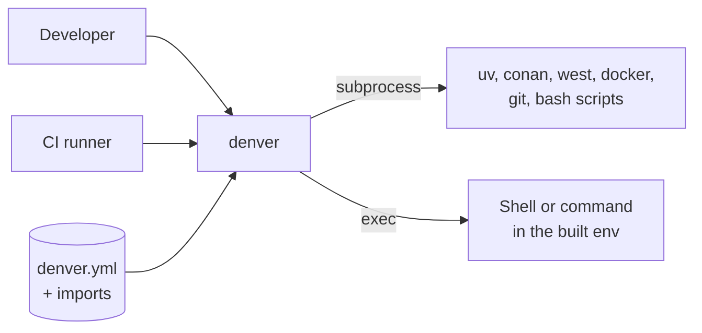

# 3. Context and Scope

Where denver stops and the tools it drives begin.

## 3.1 Business context

denver sits between whoever starts an environment and the tools that build
it. It owns none of those tools. It decides *when* to call them and *with
which arguments*, from `denver.yml`.

|                      |                                                                                                                                |
|----------------------|--------------------------------------------------------------------------------------------------------------------------------|
| **In**               | a `denver.yml` (plus everything it imports), CLI arguments, the real OS environment, the state of the filesystem               |
| **Out**              | an assembled environment, and the final command `exec()`ed inside it                                                           |
| **Not denver’s job** | what the tools themselves do. denver does not know what a Conan recipe *is*, only that `catalog.py` understands the directory. |

## 3.2 Technical context

| External system             | Interface                                                                           | Driven by                                     | Notes                                                                                            |
|-----------------------------|-------------------------------------------------------------------------------------|-----------------------------------------------|--------------------------------------------------------------------------------------------------|
| `uv`                        | subprocess (`uv venv`, `uv python install`, `uv pip install`, `uv pip freeze`)      | `uv` provider                                 | Found on `PATH`. Never assumed to exist.                                                         |
| `conan`                     | subprocess, plus `conan_scripts/catalog.py` (own script, uses the Conan Python API) | `conan` provider                              | The scripts are treated like any other external tool.                                            |
| `west`                      | subprocess (`west config`, `west update`, `west patch`, `west blobs`)               | `zephyr` provider                             | Always the first `west` on `PATH`. denver never parses west’s own config format.                 |
| `docker` / `docker compose` | subprocess (`compose build`, `compose run`)                                         | `docker` provider                             | Host side only. Inert once already inside a container.                                           |
| `git`                       | subprocess                                                                          | `git` provider, plus fingerprinting elsewhere | Clone/fetch pinned to one revision; read-only elsewhere.                                         |
| HTTP(S) servers             | `urllib`, via the provider                                                          | `download` provider                           | Release archives, checksum-verified, with `mirrors:` fallback.                                   |
| Shell scripts               | sourced or executed via `Context`                                                   | hooks, `scripts:`, `skip-if:`, `custom`       | Sourced scripts fold their exports back into the environment.                                    |
| The OS environment          | `os.environ`, `shutil.which`                                                        | `Context`                                     | `ctx.env` starts as a copy of the real environment; denver’s own `DENVER_*` variables go on top. |
| The filesystem              | direct reads/writes                                                                 | everywhere                                    | Reads config and the files it names; writes only under the env’s state dir.                      |
| PyYAML                      | Python library                                                                      | config loading                                | The only third-party runtime dependency.                                                         |

denver itself opens no network connections. Anything network-bound happens
inside a tool it called, or in the `download` provider’s own transfer.

## 3.3 Scope boundaries

denver does:

- resolve config (imports, stacking, overrides, defaults),
- decide which stages run,
- run them in order and collect their effect on the environment,
- relocate the run into a container when a wrapper stage says so,
- hand the result to a command.

denver does not:

- build software itself,
- resolve dependencies (that is uv’s, conan’s or west’s job),
- manage remote infrastructure, credentials or registries beyond passing configured values through,
- keep any state between runs except its own cache under the env’s state directory.
