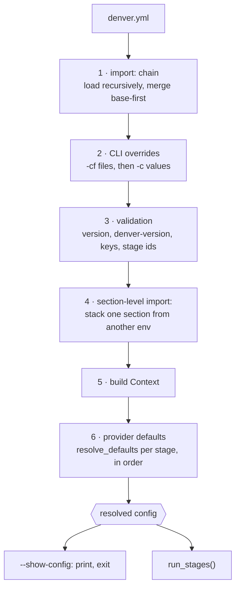
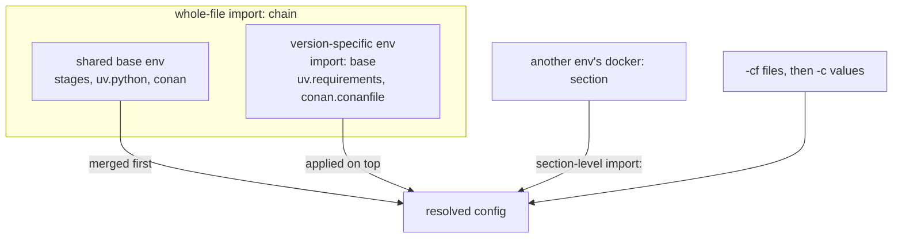

# 5.7 Config resolution

One fixed sequence turns files on disk into the config a run uses. Both
`--show-config` and the real run walk it.

## Merge rules

`deep_merge(base, override)` backs both `import:` kinds.

| Value type      | Rule                                                                                                 |
|-----------------|------------------------------------------------------------------------------------------------------|
| Mapping         | Merged key by key, recursively                                                                       |
| List            | **Appended** — lower layer’s entries first, then this layer’s. A derived env lists only what it adds |
| String / scalar | Two layers with *different* values is an error, not “last wins”                                      |

Escapes:

- `!value` — deliberate override. On a list, drops everything below it; on a string, replaces it.
- `<overwrite>` — a bare list entry that drops lower layers and is removed itself.
- `!` only means something when a lower layer actually set the key.

Why the error: a version pin inherited from a base and silently replaced in a
derived env is a real failure mode. Making it loud costs one `!`.

## The two `import:` kinds

|             | Whole-file `import:`                  | Section-level `import:`                      |
|-------------|---------------------------------------|----------------------------------------------|
| Where       | top level                             | inside one section                           |
| Pulls in    | the entire config of another env      | one named section (`path:section` to rename) |
| Typical use | version-specific env on a shared base | reuse another env’s `docker:` only           |
| Cycles      | detected, fatal                       | detected, fatal                              |

Both walk the chain nearest-layer-first when resolving relative paths, so a
derived layer’s own file wins.

A base env that is not meant to be started directly sets `runnable: false`.

## Defaults

`resolve_provider_defaults()` calls each stage’s `resolve_defaults()`, in
`stages:` order, before any `setup()` runs.

- Explicit values pass through untouched.
- Everything else gets a static, PATH-derived, or other-section-derived default.
- Optional keys with no default stay visible as `null` in `--show-config-full`.
- No resolver probes the env dir to see which conventional file happens to exist ([ADR-0002](../09_design_decisions/adr-0002-no-inferred-paths.md)).

Cost, accepted deliberately: resolution does real work (PATH lookups,
existence checks) and can fail. `--show-config` therefore doubles as a config
validator.

## Overrides and interpolation

- `-cf FILE` overlays a whole config file. Repeatable, applied in order.
- `-c KEY.PATH=VALUE` sets one dotted path. `+=` appends. The value is parsed as JSON when that works, else kept as a string. Applied last.
- `${VAR}` / `${VAR:-default}` interpolate from `ctx.env` when a section is read. Values are shell-quoted before reaching `bash -c`.
- `denver-custom-args:` lets an env declare its own CLI flags, which arrive as `DENVER_ARG_*`.

## Ordering guarantees

1. Config is fully resolved before the first stage runs.
2. A stage never sees a half-resolved section.
3. What `--show-config` prints is what the run uses — same call, not a copy.
