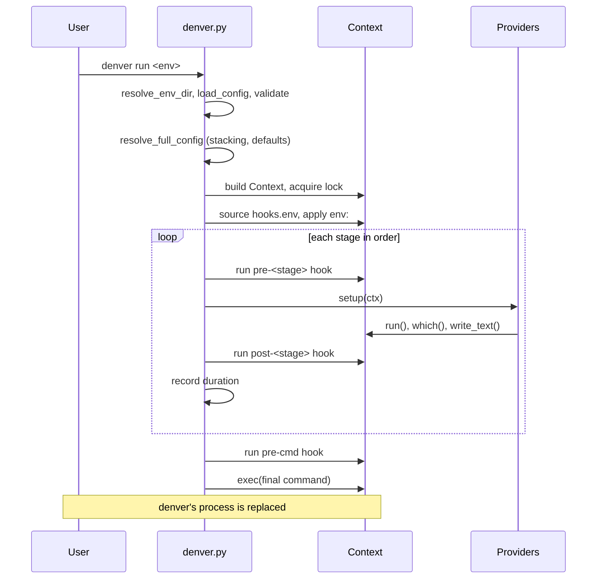
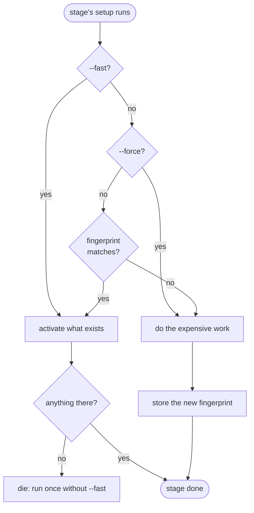
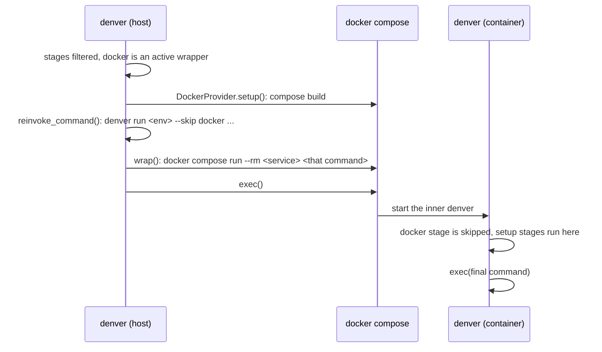

# 6. Runtime View

Five scenarios. Together they cover every path a run can take.

## 6.1 Cold run on the host

`denver run examples/simple-env` — no wrapper stage, nothing built yet.

Key points:

- The lock is held only while denver mutates state. `exec()` closes it.
- Every stage’s duration is appended to `performance.jsonl`.
- denver never lingers as a parent process.

## 6.2 Warm run

Same command, second time.

- Each stage computes a fingerprint over its real inputs (requirement files, recipe content, workspace state).
- Fingerprint unchanged → the expensive part is skipped, the cheap part (activate the venv, put tools back on `PATH`) still runs.
- `--fast` skips the check too and only activates. Nothing to activate → die.
- `--force` bypasses every fingerprint and every `skip-if:`.
- `--fast` with `--force` is rejected. They are opposites, and `--fast` wins before `--force` is even read.

## 6.3 Relocation into a container

An env stacking a `docker` wrapper before its setup stages.

- The inner run gets `DENVER_RELOCATED` (which wrapper put it there) and `DENVER_IN_CONTAINER`.
- Being in a container at all stops any wrapper from relocating again. Starting an env from inside a devshell builds right there.
- `--skip docker` runs the identical stages on the host. Same config, no second definition.
- A wrapper cannot be previewed past its own boundary — `--dry-run` says so, and points at `--skip docker`.

## 6.4 Inspecting instead of running

| Command              | Runs                                        | Stops at                                         |
|----------------------|---------------------------------------------|--------------------------------------------------|
| `--show-config`      | resolution only                             | prints the resolved config, exits                |
| `--show-config-full` | resolution only                             | same, plus every unset key as `null`             |
| `--dry-run`          | the whole pipeline, for description         | prints commands and writes instead of doing them |
| `--scripts <name>`   | that name’s scripts of every filtered stage | exits afterwards                                 |

`--dry-run` still really runs read-only queries and still sources scripts.
Both are needed to render the commands that follow. Those lines are marked
`?` and `.` in the output. It takes no lock and records no timings.

## 6.5 Failing early

Every one of these fails before any stage’s `setup()`:

| Situation                                                 | Where it dies                                |
|-----------------------------------------------------------|----------------------------------------------|
| Two layers set the same string key differently, no `!`    | `deep_merge()`, during `load_config()`       |
| Unknown top-level key or stage key                        | validation, with the closest match suggested |
| Stage section without `provider:`, or an unknown provider | `make_stage()`, from default resolution      |
| A configured path that does not exist                     | that provider’s `resolve_defaults()`         |
| `--until`/`--skip` naming a stage that is not declared    | stage filtering, listing the real stage ids  |
| The env’s `denver-version:` floor is above this denver    | version validation                           |

`die()` raises `DenverError`. `main()` catches it once and exits 1. No
provider catches it — a provider that can say something more specific
catches the concrete error (`OSError`, `CalledProcessError`) and calls
`die()` itself.
