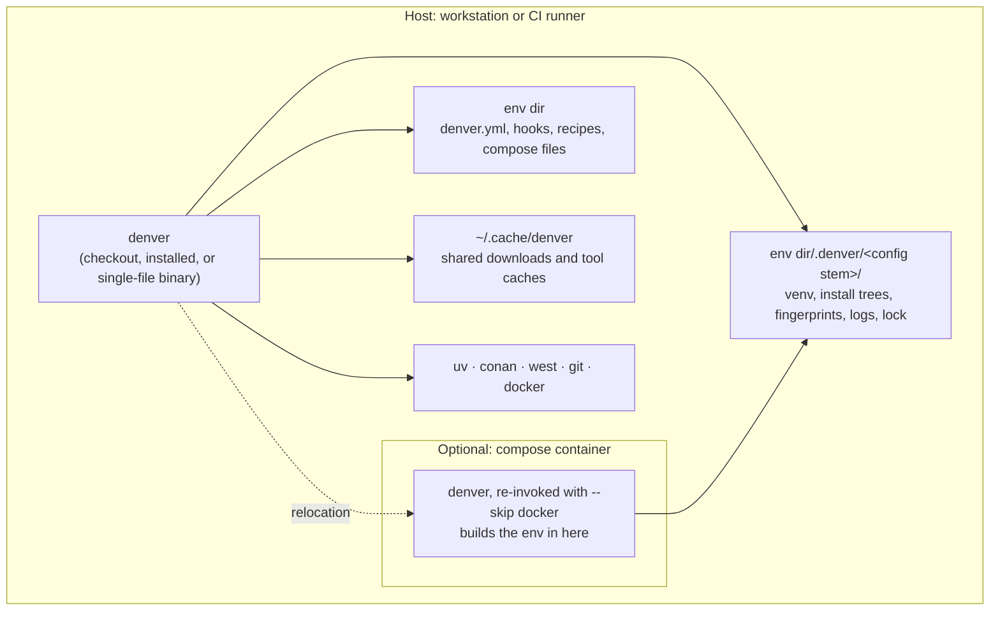

# 7. Deployment View

denver has no server side. It runs once, on the machine that invokes it, and
exits or `exec()`s into the final command.

## 7.1 Where denver runs

## 7.2 How denver itself is shipped

| Way             | Command                                                                      | Notes                                                                      |
|-----------------|------------------------------------------------------------------------------|----------------------------------------------------------------------------|
| From a checkout | `src/denver.py run <env>`                                                    | No install step. Used by this repo’s own tasks                             |
| From PyPI       | `uv tool install denver-tool`, `pipx install denver-tool`, `uvx denver-tool` | Console script `denver`                                                    |
| Prebuilt binary | download the release archive                                                 | PyInstaller single file. Built in CI for x64-linux and macOS (x64 + arm64) |
| Editable        | `uv pip install -e .`                                                        | For working on denver itself                                               |
| Vendored        | a `git` stage in another env                                                 | denver provisions denver                                                   |

All four enter the same `main()`. Version comes from `git describe` via
setuptools-scm.

## 7.3 Where state lives

| Location                           | Owner                        | Contents                                                                    | Lifetime                                                        |
|------------------------------------|------------------------------|-----------------------------------------------------------------------------|-----------------------------------------------------------------|
| `<env dir>/.denver/<config stem>/` | denver                       | venvs, conan install tree, fingerprints, logs, `performance.jsonl`, `.lock` | Per env, per config file. Delete the checkout, delete the state |
| `~/.cache/denver`                  | denver                       | downloads and caches worth sharing between envs                             | Cross-checkout                                                  |
| `<env dir>/`                       | version control              | `denver.yml`, hooks, recipes, compose files                                 | Committed source                                                |
| Container image                    | the project’s own Dockerfile | whatever it installs                                                        | Rebuilt by the `docker` stage as configured                     |

State sits *with* the env, not in a shared name-keyed pool. Two checkouts
never collide. A bind-mounted workspace carries its state into the container
with nothing extra. `<config stem>` is a level of its own so
`denver.debug.yml` and `denver.release.yml` in one folder stay separate.

`DENVER_ENV_WORKDIR` overrides the location. It is also the way out when the
env dir is read-only — denver dies rather than silently picking another
place.

## 7.4 CI

| Workflow                            | Does                                                      |
|-------------------------------------|-----------------------------------------------------------|
| `ci.yml`                            | lint, types, security, tests, coverage on Linux and macOS |
| `examples.yml`                      | runs bundled examples end to end                          |
| `build-binary.yml`                  | PyInstaller binaries for x64-linux and macOS x64 + arm64  |
| `release-binary.yml`, `publish.yml` | attach binaries to a release, publish to PyPI             |
| `docs.yml`                          | builds `doc/` and publishes to the `gh-pages` branch      |

`docs.yml` builds by running `examples/doc-env` — denver’s own docs are built
by denver. Two builders run: HTML for people, Markdown for AI tools, the
latter published under `markdown/`.

## 7.5 Network

denver opens no connections of its own, except the `download` provider’s
transfers. Everything else is whatever `uv`, `conan`, `west` or `docker` do
downstream. Offline modes exist per provider (`no-index`, conan without
remotes, fingerprint-skipped `west update`).
