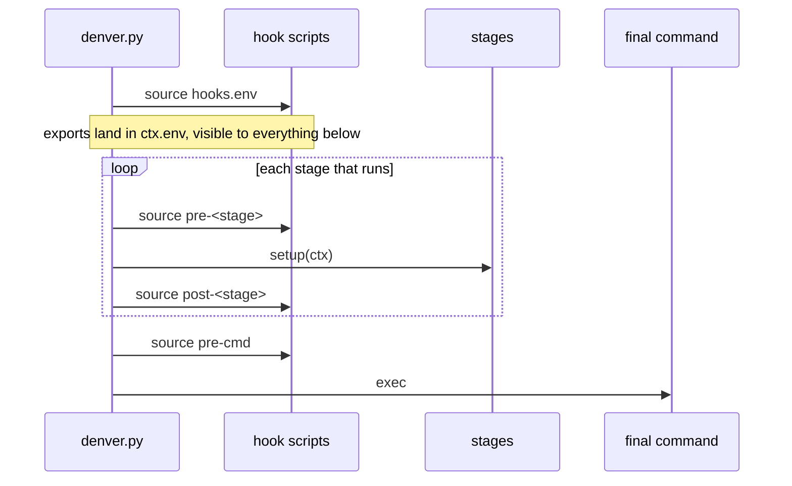
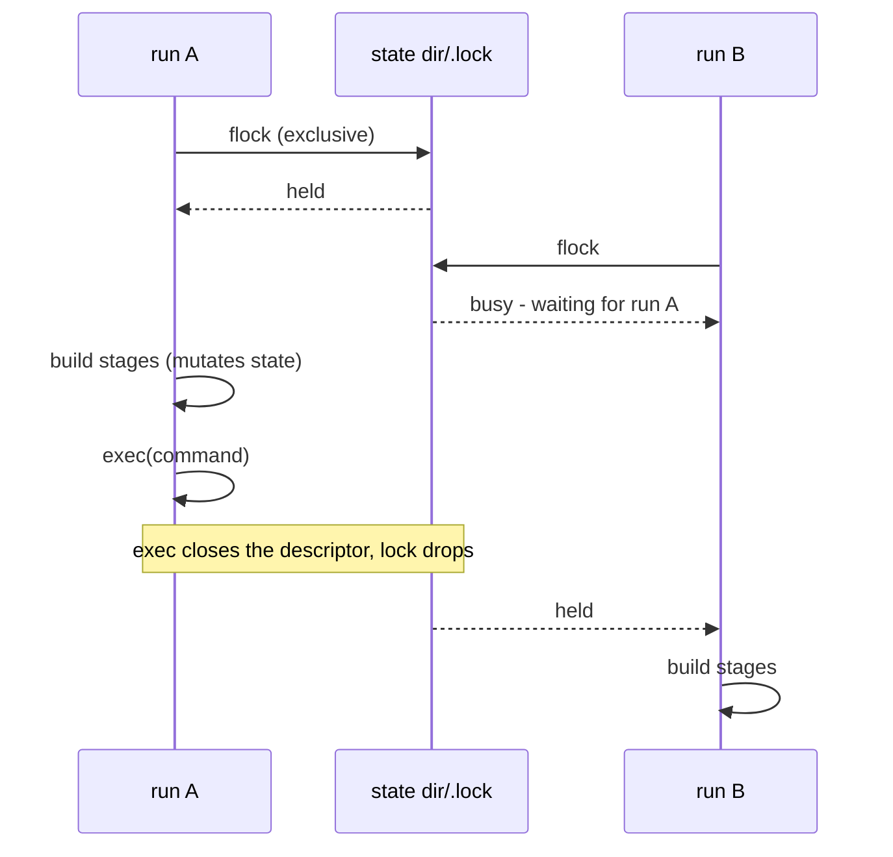

# 8. Cross-cutting Concepts

Mechanisms no single building block owns.

## 8.1 Error handling

- `die(message)` logs the message and raises `DenverError`.
- `main()` catches it once and exits 1. Nothing else catches it.
- A caller that can be more specific catches the concrete error (`OSError`, `CalledProcessError`) and calls `die()` with that context.
- `denver_errors.py` is a leaf module. `denver.py` and `denver_providers/` both import it; it imports neither. That keeps `--help`/`--version` from importing every provider.

## 8.2 Fail loud

Unknown things are errors, never no-ops:

| Unknown                        | Reaction                                             |
|--------------------------------|------------------------------------------------------|
| Top-level key                  | die, with the closest known key suggested            |
| Key in a stage’s section       | die, listing what that provider understands          |
| Stage id in `--until`/`--skip` | die, listing the declared stage ids                  |
| Provider name                  | die, listing the registered providers                |
| Key under `extensions:`        | die — a typo must not disable the mechanism silently |

## 8.3 Config merging

One function, `deep_merge()`, behind both `import:` kinds. Mappings merge,
lists append, conflicting strings die unless marked `!`. Full rules:
[config resolution](../05_building_block_view/config_resolution.md).

## 8.4 Path resolution

`Context.resolve_path(value)`:

- absolute path → used as is,
- relative path → tried against the env dir, then each imported base env dir, nearest first.

So a derived env can name `conan/base_classes` even though the directory only
exists in its base. This resolves paths the author wrote. It never guesses
which paths exist ([ADR-0002](../09_design_decisions/adr-0002-no-inferred-paths.md)).

## 8.5 Central defaults

A provider’s `setup()` never computes a default and never validates a path.
It reads keys that `resolve_defaults()` already filled in. One place per
provider, called once per run, before any stage runs. See
[ADR-0001](../09_design_decisions/adr-0001-central-default-resolution.md).

## 8.6 Interpolation

- `${VAR}` and `${VAR:-default}` are expanded from `ctx.env` when a section is read.
- `ctx.env` = the real environment, plus denver’s own `DENVER_*` variables, plus whatever hooks and stages exported.
- Values are shell-quoted before they reach `bash -c`.
- This is the only computation available in config. Anything more belongs in a script.

## 8.7 Hooks and scripts

|              | Hooks                                                  | `scripts:`                                                     |
|--------------|--------------------------------------------------------|----------------------------------------------------------------|
| Names        | fixed: `env`, `pre-<stage>`, `post-<stage>`, `pre-cmd` | open-ended, chosen by the env                                  |
| Run          | automatically, at their point                          | only via `--scripts <name>` (or `--setup`/`--login`/`--clean`) |
| Executed how | **sourced**, so exports persist                        | executed                                                       |
| Inheritance  | additive — every layer’s entries run, base first       | stacks the same way                                            |

Nothing is discovered from the directory. A script runs only if config lists
it. A listed script that is missing is an error. A personal layer is just
another entry (`hooks/env.user.sh`), placed last.

Additive inheritance is the one deliberate exception to override-wins: a hook
is an action, not a value.

## 8.8 Stage selection

Which stages run is decided before any of them do:

- `--until <stage>` truncates the pipeline. There is no “only this stage” flag — a stage almost always needs its predecessors.
- `--skip <stage>` drops single stages. Repeatable.
- `disabled: true` opts a stage out by default.
- `depends-on:` cascades a skip: if a dependency did not run, the dependent is skipped too.
- Filtered-out stages disappear from `--show-config` as well, section and `stages:` entry alike.

## 8.9 Runtime toggles

Set once from flags, never from environment variables:

| Toggle       | Effect                                                                               |
|--------------|--------------------------------------------------------------------------------------|
| `--force`    | Redo expensive work. Bypass fingerprints and `skip-if:`                              |
| `--fast`     | Skip every build step, activate only. Mutually exclusive with `--force`              |
| `--ci`       | Narrower/faster args where a provider has them (currently west’s shallow clone)      |
| `-q` / `-qq` | `-q` silences denver’s own output, `-qq` also the stages’ tools. Errors always print |
| `-v`         | Sub-step banners, timings, echoed commands                                           |
| `--dry-run`  | Describe instead of doing                                                            |

They are deliberately outside the config-defaults mechanism. Baking a
per-invocation toggle into a resolved value would defeat it.

## 8.10 Fingerprinting

- Each stage that does real work hashes its real inputs: file content, resolved arguments, workspace layout.
- Content and layout, never absolute paths — so a moved checkout does not invalidate everything.
- Match → skip the expensive part. Mismatch → redo it and store the new fingerprint.
- Fingerprints live in the env’s state dir, so removing that dir forces a clean rebuild.

## 8.11 Dry-run and testability, from one seam

Every subprocess goes through `Context.run()`/`exec()`. Every write goes
through `Context.write_text()`/`mkdir()`/`rmtree()`/…. No provider imports
`subprocess` or `shutil`.

Consequences:

- `--dry-run` intercepts one object, not fifty call sites.
- Tests patch the same seam and run fully offline, with no real tool installed.
- A provider reaching around those helpers is a visible review mistake, not a silent hole.

## 8.12 Concurrency

- One run per environment. An exclusive lock on `<state dir>/.lock`.
- A second run waits and says whose run it waits for. `--no-wait` fails instead.
- The lock is never released explicitly. `exec()` closes the descriptor, so it lasts exactly as long as denver mutates state. A long-lived devshell holds nothing.
- A wrapper relocation cannot deadlock: the outer process is gone at `exec()` before the inner one asks.
- No `flock` on the filesystem → warn and continue, rather than pretend.

## 8.13 Output and tracing

- Default output: the `-- [i/n] stage 'id' (provider)` trail, plus whatever the stage’s own tool prints.
- Color is auto-detected. `NO_COLOR` and `FORCE_COLOR` override.
- Every stage’s duration goes to `<state dir>/performance.jsonl`, as Chrome Trace Event JSON lines. Load them in `chrome://tracing` or Perfetto.
- `--dry-run` records no timings — they would measure printing, not working.

## 8.14 Isolation

- Each `uv` stage can have its own venv; several stages may deliberately share one.
- Host and in-container venvs are kept apart, so a bind-mounted checkout does not mix them.
- All generated state lives under the env’s state dir, never inside the env’s source folder.
