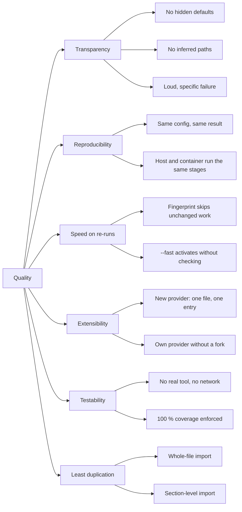

# 10. Quality Scenarios

The goals from [chapter 1.2](../01_introduction_and_goals/index.md), made
checkable.

## 10.1 Quality tree

## 10.2 Scenarios

| #     | Situation                                                                                | Expected reaction                                                                                                                               |
|-------|------------------------------------------------------------------------------------------|-------------------------------------------------------------------------------------------------------------------------------------------------|
| QS-1  | Someone reads `--show-config` to find out what a run will do.                            | It matches the run exactly. Both call the same resolution function ([ADR-0001](../09_design_decisions/adr-0001-central-default-resolution.md)). |
| QS-2  | Two layers set the same string key to different values, no `!`.                          | Dies during config load, naming the key, both values, and the `!` escape. Nothing has run yet.                                                  |
| QS-3  | A stage section has no `provider:`, or an unknown one.                                   | Dies during default resolution, listing the registered providers.                                                                               |
| QS-4  | A configured path does not exist.                                                        | Dies at resolution time, before any stage changes the machine.                                                                                  |
| QS-5  | Someone drops `hooks/env.sh` next to a `denver.yml` without listing it.                  | Nothing happens. Only listed scripts run ([ADR-0002](../09_design_decisions/adr-0002-no-inferred-paths.md)).                                    |
| QS-6  | A key or stage id is misspelled.                                                         | Dies, and suggests the closest real name.                                                                                                       |
| QS-7  | The same env is run again with nothing changed.                                          | Every stage’s fingerprint matches. No expensive work re-runs. The env is activated and the command starts.                                      |
| QS-8  | A requirement file changes by one line.                                                  | That stage’s fingerprint mismatches, that stage rebuilds, the others still skip.                                                                |
| QS-9  | `--fast` on an env that was never built.                                                 | Dies with a clear message saying to run once without `--fast`.                                                                                  |
| QS-10 | The same env is run once with Docker and once with `--skip docker`.                      | Identical stages, identical config. No separate containerized definition exists.                                                                |
| QS-11 | An env is started from inside a devshell container.                                      | No second container. The wrapper sees it is already inside and builds right there.                                                              |
| QS-12 | A project needs a provisioning step denver has no provider for.                          | One file in an `extensions: providers: dirs:` directory, no fork, full lifecycle.                                                               |
| QS-13 | A new provider is added to denver itself.                                                | One module plus one `PROVIDERS` entry. `run_stages()` and `make_stage()` unchanged.                                                             |
| QS-14 | The test suite runs on a machine with no `uv`, `conan`, `west`, `docker` and no network. | Passes. Every outside call goes through `Context.run()`/`which()`, which the tests patch.                                                       |
| QS-15 | A change adds a branch without a test.                                                   | `poe test` fails on `--cov-fail-under=100`, naming the uncovered lines.                                                                         |
| QS-16 | A function grows past the complexity gate.                                               | `complexipy` fails the build at `max-complexity-allowed = 8`.                                                                                   |
| QS-17 | Two runs of the same env start at once.                                                  | The second waits, saying whose run it waits for. `--no-wait` fails instead.                                                                     |
| QS-18 | A derived env needs a file that only exists in its base env’s directory.                 | `resolve_path()` finds it — nearest import dir first — without the derived env repeating the path.                                              |
| QS-19 | Someone wants to see what a run does without doing it.                                   | `--dry-run` prints every command and write, marked by kind, and does neither.                                                                   |
| QS-20 | A first run was slow and nobody knows where the time went.                               | `performance.jsonl` in the state dir, loadable in `chrome://tracing` or Perfetto.                                                               |
